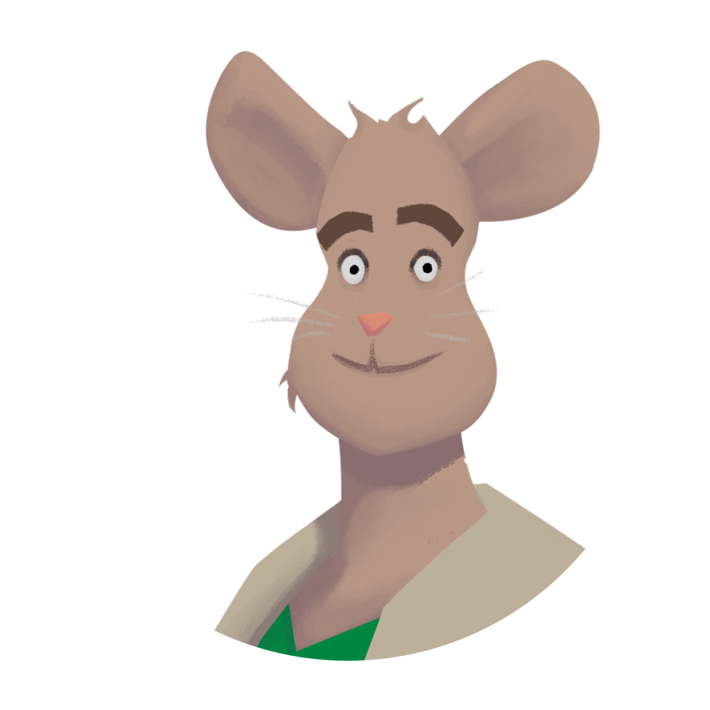

# inclumove_graphics

This repository contains packages of graphic materials such as designs, animations and illustrations – created in the incluMOVE project. 
They are licensed under the **Creative Commons BY-SA License 4.0**. Please read each license file and preserve its terms of use.

---

## How to use it
1. Read our [wiki](../../wiki) to get more information about the content of our packages and licenses. 
2. Read the license of the package you want to use carefully and give attributions to the creators. 
3. Download the package and use it for your project. 
4. (Optional) Contact us and tell us what you created with our material. We are curious!

---

## Releases 

***
### Gregor Gouda – A virtual assistant (designs and animations)
Release Date: 27.04.2020 - [LICENSE](LICENSE-GREGOR-GOUDA.md) - Size: 502 MB - [View Here](images/gregor-gouda) - Download Zip here  
Gregor is designed to be a teacher figure and a friendly colleague, who supports and motivates his target group. He is a (virtual) assistant.

---
  
Shield: [![CC BY-SA 4.0][cc-by-sa-shield]][cc-by-sa]

This work is licensed under a [Creative Commons Attribution-ShareAlike 4.0
International License][cc-by-sa].

[![CC BY-SA 4.0][cc-by-sa-image]][cc-by-sa]

[cc-by-sa]: http://creativecommons.org/licenses/by-sa/4.0/
[cc-by-sa-image]: https://licensebuttons.net/l/by-sa/4.0/88x31.png
[cc-by-sa-shield]: https://img.shields.io/badge/License-CC%20BY--SA%204.0-lightgrey.svg
